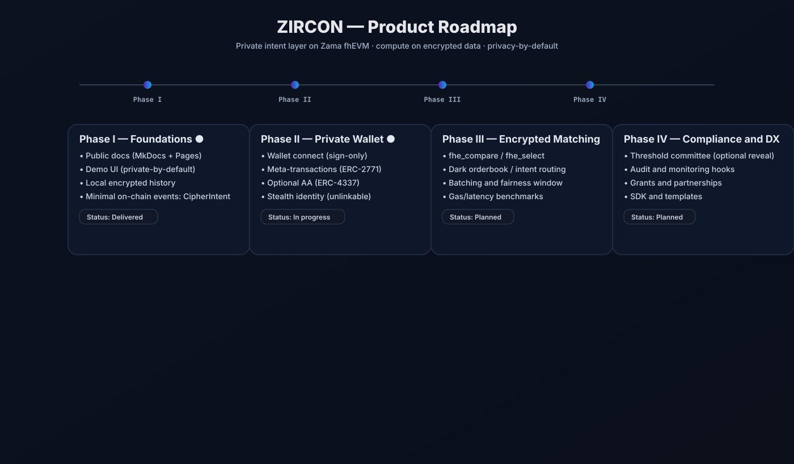

<p align="center">
  
</p>

<div align="center">

### **ZIRCON — Dark Liquidity Intent Layer (fhEVM)**
**Private Orderflow · Encrypted Matching · Minimal Reveal**

[📚 Docs](https://ekkalamrani328.github.io/zircon-fhevm/) •
[🚀 Demo](https://ekkalamrani328.github.io/zircon-fhevm/demo/) •
[👤 Developer](https://github.com/Ekkalamrani328)

</div>

---

### **What is ZIRCON?**
ZIRCON is a **privacy-preserving intent layer**.  
Trade parameters (price, amount, side) are **encrypted before submission** and **matched while still encrypted** using **Zama’s FHE-enabled EVM (fhEVM)**.

> No mempool leakage.  
> No visible orderflow.  
> No front-running.

---

### **How FHE is Used**
- The client encrypts trade intents locally.
- Smart contracts compute on ciphertext using `fhe_compare` / `fhe_select`.
- Only **status** (submitted / matched) is public — not values.

---

### **Architecture (Simple View)**

| Role | Visibility | Description |
|---|---|---|
| Client | Private | Encrypts & stores cleartext history local-only. |
| fhEVM Contract | Public (ciphertext only) | Performs encrypted matching. |
| Committee *(optional)* | Controlled | Allows partial reveal only if required. |


<p align="center">
  
</p>
---

### **Roadmap (Summary)**

<p align="center">
  
</p>

**Current:** Phase I — Foundations *(✔ Completed)*  
Next phases are **optional** and exploratory.

---

### Quick Start

```bash
👉 For full documentation, tutorials, and integration guide, see: /zircon-fhe-intents/docs/index.md
