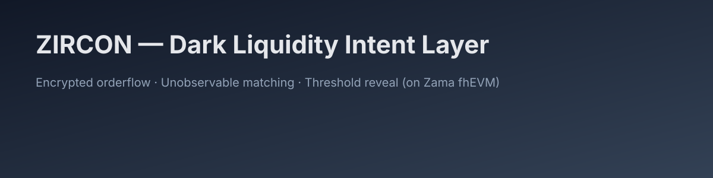

  

**ZIRCON — Dark Liquidity Intent Layer (fhEVM)**  
Encrypted Orderflow • Unobservable Matching • Threshold Reveal

 

npm install
npm run build
npm run dev

---

ZIRCON provides a confidential execution environment for intent-based trading using **Fully Homomorphic Encryption (FHE)** deployed on the **Zama fhEVM** runtime.

The system ensures that **all orderflow and matching logic remain encrypted**, enabling secure and private execution of intent-based interactions.

---

System Architecture

  

### Components

| Component | Responsibility | Trust Boundary |
|---------|----------------|----------------|
| **Client / Wallet** | Encrypts intents using public FHE key. Maintains local cleartext state. | User-side only. Private. |
| **fhEVM Smart Contract** | Executes matching logic *directly* over ciphertext. Emits encrypted state transitions. | On-chain. Zero plaintext disclosure. |
| **Threshold Committee (Optional)** | Participates only in controlled reveal scenarios (settlement / view keys / regulatory modes). | Distributed & auditable. |

---

## 3. Security Properties

| Property | Guarantee |
|---------|-----------|
| **Orderflow Privacy** | No participant, relayer, or validator can infer trade intent. |
| **Unobservable Matching** | Matching logic executes over encrypted values (FHE). |
| **Minimal Reveal** | Settlement requires only cryptographically bounded reveal. |
| **EVM Compatibility** | Contracts deployable on any fhEVM network instance. |

## Quick Start

[![🚀 Live Demo]

## 📜 License
MIT © 2025 — Iremsena Development Initiative

